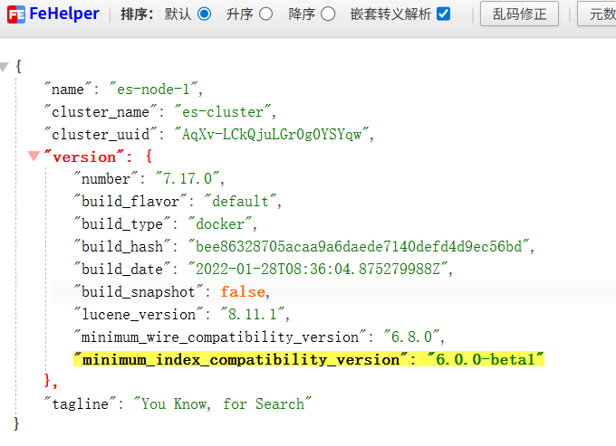

# 目的

1.完成聚合搜索 ，搜索一个一下的所有内容都会被搜索出来
（1）用户
（2）照片
（3）代码块 

2.ES的搜索实现倒排索引

3.EZ和MYSQL的同步
（1） 增量同步
（2） 全局同步


4.jmeter的使用


# docker es 构建

windows
先确定使用的版本：elasticsearch 7.17.0
在任意位置（比如桌面）创建文件夹 es-docker，内部结构如下：
```
es-docker/
├── es-config/          # ES 配置文件夹
│   └── elasticsearch.yml
├── es-plugins/         # 分词器插件文件夹
│   └── ik/             # IK 分词器目录
└── docker-compose.yml  # 启动配置文件
```
在当前文件下创建目录
```
# 创建目录
mkdir -p es-docker/es-config,es-docker/es-plugins/ik
cd es-docker
```
下载 IK 分词器（Windows 版）:https://release.infinilabs.com/analysis-ik/stable/

解压压缩包：
将解压后的所有文件（不是外层文件夹）直接复制到 es-docker/es-plugins/ik/ 目录下（确保 ik 目录下有 plugin-descriptor.properties 等文件）。

编写配置文件（docker-compose.yml）：

```
services:
elasticsearch:
image: elasticsearch:7.17.0  # 版本和IK分词器保持一致
container_name: es7-windows
restart: always
environment:
- "ES_JAVA_OPTS=-Xms512m -Xmx512m"  # JVM内存，Windows按需调整
- "discovery.type=single-node"      # 单节点模式
- "cluster.name=es-cluster"
- "node.name=es-node-1"
# Windows 下关闭内存锁定（避免权限问题）
- "bootstrap.memory_lock=false"
ports:
- "9200:9200"  # 外部访问端口
- "9300:9300"
volumes:
# Windows 路径挂载（绝对路径/相对路径都可，这里用相对路径）
- ./es-config/elasticsearch.yml:/usr/share/elasticsearch/config/elasticsearch.yml
- ./es-plugins:/usr/share/elasticsearch/plugins
- es-data:/usr/share/elasticsearch/data  # 数据持久化（Docker 卷）
networks:
- es-network

volumes:
es-data:

networks:
es-network:
driver: bridge
```
elasticsearch.yml
```
# 基础配置
cluster.name: es-cluster
node.name: es-node-1
path.data: /usr/share/elasticsearch/data
path.logs: /usr/share/elasticsearch/logs

# 网络配置（允许所有IP访问）
network.host: 0.0.0.0
http.port: 9200

# 跨域配置（方便前端/Kibana访问）
http.cors.enabled: true
http.cors.allow-origin: "*"

# IK分词器无需额外配置，挂载后自动生效
```
启动 ES 容器 在docker-compose.yml 目录下：
```
docker-compose up -d
```

验证 ES 启动成功
打开浏览器，访问：http://localhost:9200，返回如下内容即成功：


分词器测试：
请求方式：POST
URL：http://localhost:9200/_analyze?pretty
请求头：添加 
`Content-Type: application/json`
请求体（Raw → JSON）：
```json
{
"analyzer": "ik_smart",
"text": "我爱中国"
}
```
查看有没有分词的结果